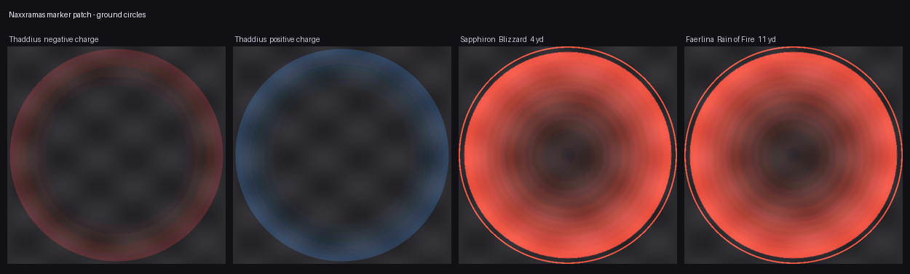
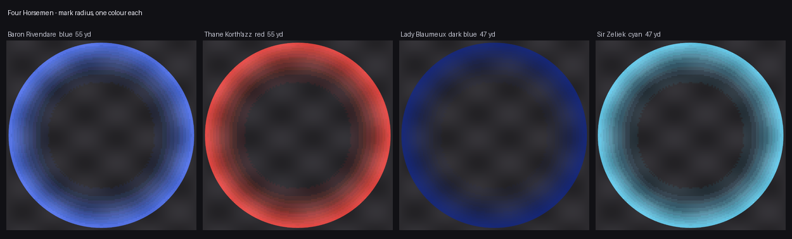
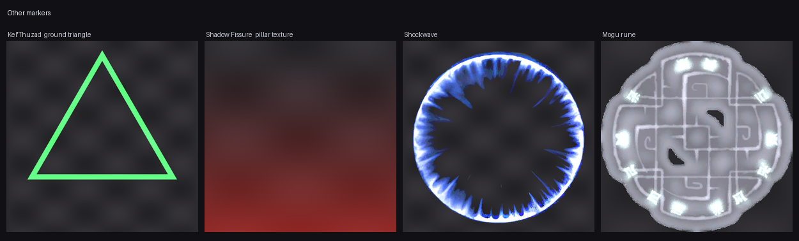

# Naxxramas marker patch — `patch-ruRU-Z.MPQ`

A client-side MPQ patch for **WoW 3.3.5a (WotLK), ruRU locale** that draws ground markers for
Naxxramas boss mechanics — polarity circles, damage zones and mark radii — so the raid can see
where an effect actually reaches instead of guessing.

Nothing runs on the server. Every change lives in the patch: drop the file in and it works,
remove it and the client is exactly as before. Radii are taken from the spell data, not eyeballed.

## What it draws

### Ground circles

| Boss | Marker | Radius |
|---|---|---|
| **Thaddius** | polarity circles under players — red on negative charge, blue on positive | — |
| **Sapphiron** | circles under the Blizzard, following its damaging trail | 4 yd |
| **Grand Widow Faerlina** | circle under Rain of Fire | 11 yd |

### Four Horsemen

Each horseman self-casts his Mark and it lands on **everyone inside the effect radius** — and the
radius is not the same for all four. Each boss carries a circle on his own radius, in his own
colour, so you can see which of them you are standing inside.

| Horseman | Mark | Colour | Radius |
|---|---|---|---|
| Baron Rivendare | 28834 | blue | 55 yd |
| Thane Korth'azz | 28832 | red | 55 yd |
| Lady Blaumeux | 28833 | dark blue | 47 yd |
| Sir Zeliek | 28835 | cyan | 47 yd |

### Other markers

| Boss | Marker |
|---|---|
| **Kel'Thuzad** | a flat triangle on the ground under him |
| **Maexxna** | Web Wrap cocoons rendered 6× larger, so a wrapped player is easy to spot |
| **Shadow Fissure** | the flat spinning rune replaced with a vertical pillar, visible from across the room |

The patch replaces no existing file — not Blizzard's and not Patch-Y's. Every model and texture
it ships has a name of its own, so nothing outside these markers changes.

Two side effects no client patch can avoid, because the server only tells the client which
display to draw and these displays are shared:

- the Rivendare circle also shows under Baron Rivendare in Stratholme (same display, 10729);
- the ×6 cocoon also applies to seven other web-wrapped creatures outside Naxxramas (display 16213).

## Install

1. **Install [Patch-Y by Andre](https://www.curseforge.com/wow/addons) first** (`Patch-ruru-y.mpq`)
   — this patch's DBC tables are built on top of his, so it has to load after Patch-Y. Without
   Patch-Y, his table edits would be switched on without the models they point to.
2. Copy `patch-ruRU-Z.MPQ` into `<WoW>\Data\ruRU\`.
3. Restart the client.

To uninstall, delete the file.

## How it is built

Three techniques, depending on what the marker has to follow:

- **Spell visual chain** — for effects that create a ground area (Blizzard, Rain of Fire), a new
  `SpellVisualEffectName` is pointed at a circle model and hooked into the effect's persistent-area
  kit. The circle then appears and disappears exactly with the real damage zone.
- **Geometry welded into the creature model** — for markers that must follow a boss (the Horsemen
  rings, Kel'Thuzad's triangle), a flat submesh is added straight into the M2, anchored to a static
  bone so it tracks position and facing without inheriting body animation.
- **DBC scale** — for the cocoons, a single client-side scale field.

Every shared model or spell visual is **cloned** before use, and only the one boss that needs it is
repointed, so no other creature or spell in the game is affected. All four LOD skins keep working.

## Credits

Built on top of **Patch-Y by Andre**: the DBC tables start from his, and the Thaddius, Sapphiron
and Faerlina circles are derived from his `Range_Circle` model.

Game assets are property of Blizzard Entertainment. This patch contains modifications of client
data for use on private servers and is not affiliated with or endorsed by Blizzard.
